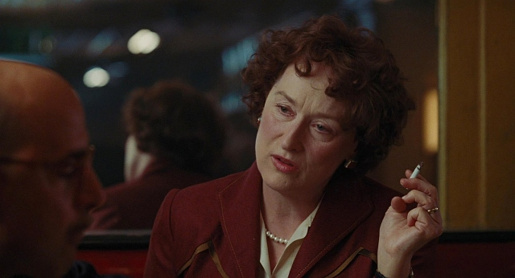
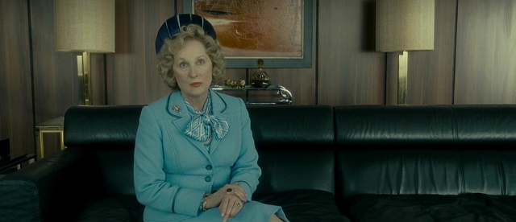
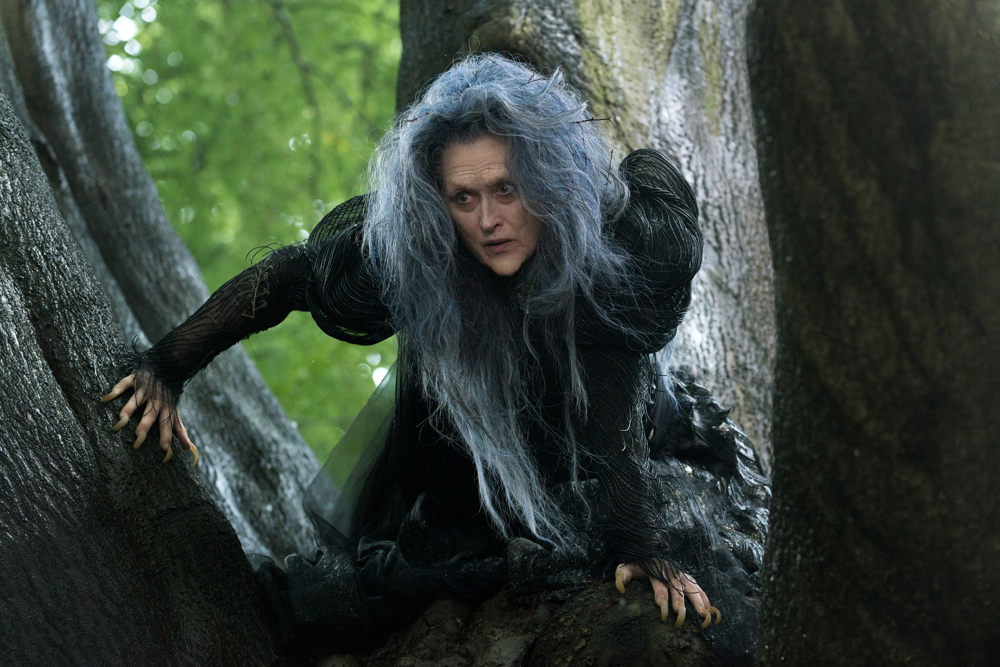
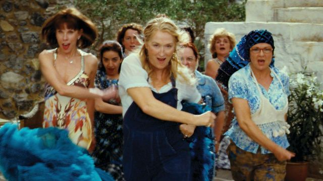
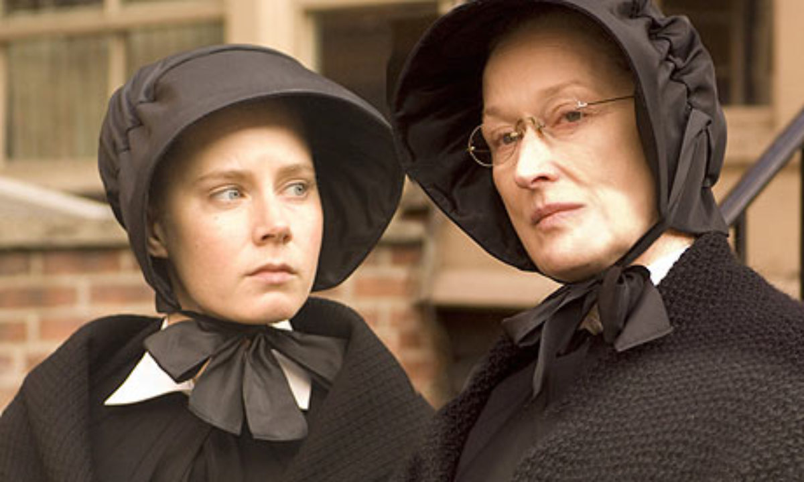

<div align="center">

# 👊 STREEP FIGHTER 👊

### _Meryl Kombat_

A 2D arcade-style fighting game starring six iconic Meryl Streep characters.
Built with Godot 4.6 and C#.


---


</div>

---

## 🎬 About

**Streep Fighter** is a love letter to both classic 90s arcade fighters and the greatest actress of all time. Pick your favorite Meryl, choose a stage inspired by her filmography, and duke it out in best-of-3 rounds.

Features PvP local multiplayer and a VS CPU mode with AI opponent.

---

## 🎭 The Roster

Six playable fighters, each with unique stats and a signature special move.

<table>
<tr>
<td align="center" width="33%">
<br/>
<b>Miranda Priestly</b><br/>
<i>The Devil Wears Prada (2006)</i><br/><br/>
<b>Special:</b> "That's All" — Lightning dash-slap<br/>
<b>Type:</b> ⚡ Speedster<br/>
<code>HP 1000 · SPD 250 · DMG 150</code>
</td>
<td align="center" width="33%">
<br/>
<b>Julia Child</b><br/>
<i>Julie & Julia (2009)</i><br/><br/>
<b>Special:</b> "Bon Appétit" — Throws a pot projectile<br/>
<b>Type:</b> 🍳 Zoner<br/>
<code>HP 1000 · SPD 200 · DMG 180</code>
</td>
<td align="center" width="33%">
<br/>
<b>Margaret Thatcher</b><br/>
<i>The Iron Lady (2011)</i><br/><br/>
<b>Special:</b> "Iron Fist" — Armored power punch<br/>
<b>Type:</b> 🛡️ Tank<br/>
<code>HP 1200 · SPD 180 · DMG 250</code>
</td>
</tr>
<tr>
<td align="center">
<br/>
<b>The Witch</b><br/>
<i>Into the Woods (2014)</i><br/><br/>
<b>Special:</b> "Curse of the Woods" — Curse projectile<br/>
<b>Type:</b> 🔮 Glass Cannon<br/>
<code>HP 900 · SPD 220 · DMG 200</code>
</td>
<td align="center">
<br/>
<b>Donna Sheridan</b><br/>
<i>Mamma Mia! (2008)</i><br/><br/>
<b>Special:</b> "Dancing Queen" — Double spin attack<br/>
<b>Type:</b> 💃 Combo Fighter<br/>
<code>HP 950 · SPD 280 · DMG 130</code>
</td>
<td align="center">
<br/>
<b>Sister Aloysius</b><br/>
<i>Doubt (2008)</i><br/><br/>
<b>Special:</b> "Divine Discipline" — Lunging knockback strike<br/>
<b>Type:</b> ✝️ Bruiser<br/>
<code>HP 1100 · SPD 200 · DMG 180</code>
</td>
</tr>
</table>

---

## 🗺️ Stages

Six arenas inspired by Meryl's filmography, each hand-built with Polygon2D pixel art.

| Stage                   | Film                    | Location              |
| ----------------------- | ----------------------- | --------------------- |
| **Runway Magazine**     | _The Devil Wears Prada_ | New York City         |
| **Julia's Kitchen**     | _Julie & Julia_         | Paris, France         |
| **House of Commons**    | _The Iron Lady_         | London, England       |
| **Enchanted Woods**     | _Into the Woods_        | A dark magical forest |
| **Kalokairi Island**    | _Mamma Mia!_            | Greece                |
| **St. Nicholas Church** | _Doubt_                 | The Bronx, New York   |

---

## 🕹️ Controls

### Player 1 (Keyboard Left)

| Key       | Action            |
| --------- | ----------------- |
| `A` / `D` | Move Left / Right |
| `W`       | Jump              |
| `S`       | Crouch            |
| `F`       | Punch             |
| `G`       | Kick              |
| `H`       | Block             |
| `T`       | Special Move      |

### Player 2 (Keyboard Right)

| Key       | Action            |
| --------- | ----------------- |
| `←` / `→` | Move Left / Right |
| `↑`       | Jump              |
| `↓`       | Crouch            |
| `Num1`    | Punch             |
| `Num2`    | Kick              |
| `Num3`    | Block             |
| `Num0`    | Special Move      |

---

## 🏗️ Project Structure

```
streep-fighter/
├── Assets/Portraits/          # Character select portraits
├── Scenes/
│   ├── Fighters/              # Fighter models & projectiles (.tscn)
│   ├── Stages/Backgrounds/    # 6 hand-built Polygon2D stage backgrounds
│   └── UI/                    # Title, CharSelect, StageSelect, HUD, Victory
├── Scripts/
│   ├── AI/                    # CPU opponent controller
│   ├── Fighters/              # Fighter base class, subclasses, stats
│   ├── Managers/              # GameManager, GameState, StageData
│   └── UI/                    # All UI screen scripts
├── project.godot
└── StreepFighter.csproj
```

---

## ⚔️ Game Mechanics

- **Best of 3 rounds** — First to 2 round wins takes the match
- **90-second timer** — If time runs out, the fighter with more HP% wins the round
- **Blocking** — Reduces incoming damage (varies per fighter, 70%–92% reduction)
- **Special moves** — Unique per fighter, with cooldowns ranging from 3–5 seconds
- **Knockback** — Hits push opponents toward the arena walls
- **Health color** — Bars shift from green → yellow → red as damage accumulates

---

## 🚀 Getting Started

### Requirements

- [Godot 4.6](https://godotengine.org/) with .NET support
- [.NET 8.0 SDK](https://dotnet.microsoft.com/download)

### Running

1. Clone the repo
2. Open `project.godot` in Godot 4.6 (.NET edition)
3. Build the C# solution (`dotnet build` or via Godot editor)
4. Hit Play (F5)

---

## 🎥 Game Flow

```
🎬 Title Screen
   ├── VS Player (PvP)
   └── VS CPU
         ↓
🎭 Character Select
   P1 picks fighter → P2 picks (or CPU auto-picks)
         ↓
🗺️ Stage Select
   Pick your arena from 6 movie-themed stages
         ↓
👊 FIGHT!
   Best of 3 rounds · 90 seconds each
         ↓
🏆 Victory Screen
   Winner announced → Return to title
```

---

<div align="center">

_"I don't know why I'm so scary. I don't want to be."_

— Meryl Streep, before selecting Margaret Thatcher and landing a 250-damage Iron Fist

---

Made with 🎬 and 👊 in Godot 4.6

_Photo: [Meryl Streep by Lincoln Townley](https://commons.wikimedia.org/wiki/File:Meryl_Streep_by_Lincoln_Townley.JPG), CC BY-SA 4.0_

</div>
